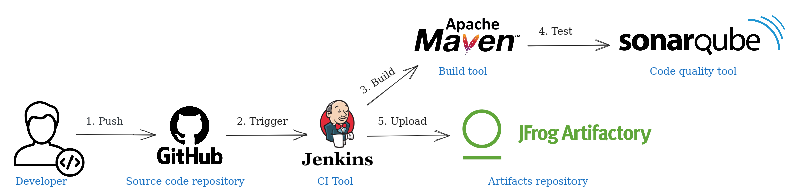

# Jenkins pipeline for Java application
Jenkins pipeline using SonarQube, Maven, and Artifactory for a basic calculator application written in Java, forked from [HouariZegai/Calculator](https://github.com/HouariZegai/Calculator).  

**Important note:** This project is based on having a Jenkins master and agent connected.


 לערוך את התמונה של הארכיטקטורה שיהיה נוטיפיקיישן דרך דוסקורד.

 להוסיף צילום מסך של הפייליין בג'נקינס של השלבים שהצליחו  

לחשוב איך לעשות טריגל לפייליין של ג'נקינס מהגיהאב אם בכלל שיהיה טריגר
 או לעשות שלא יהיה תריגל בכלל ולשנות את התמונה של הארכיטקטורה

## Create Artifactory and SonarQube servers

### Artifactory

#### Artifactory quick setup
Launch an instance in AWS using Ubuntu 20.04 image, instance type t3.medium, and add external ports: 8081, 8082.
1. Download the installer
```bash
wget -O artifactory-pro.deb "https://releases.jfrog.io/artifactory/artifactory-pro-debs/pool/jfrog-artifactory-pro/jfrog-artifactory-pro-[RELEASE].deb"
```
2. Install Artifactory
```bash
sudo apt install ./artifactory-pro.deb -y
```
3. Start the service
```bash
sudo systemctl start artifactory.service
```

#### Access the JFrog Platform

```URL
http://<hostname>:8082
```

For Example http://localhost:8082 or http://192.168.86.243:8082

The JFrog Platform will take about a minute to start up.

Once the platform is up, log in using username `admin` and password `password`.

#### Connect Artifactory with Jenkins
להסביר איך חיברנו בין ארטיפאקטורי וג'נקינס. כולל רישיון וכל מה שצריך וטוקן וזה  
צריך לעשות רישיון עדיין אל עשיתי

### SonarQube
#### Installing an instance of SonarQube with Docker image

Launch an instance in AWS using Ubuntu 22.04 image, instance type t2.medium, and add external port: 9000.   
  
**Important note:** Before you continue make sure you have docker installed in this instance

1. Start the Docker container by running:

```
docker run -d --name sonarqube -e SONAR_ES_BOOTSTRAP_CHECKS_DISABLE=true -p 9000:9000 sonarqube:latest
```
2. Update the restart policy to always
```
 docker update --restart always sonarqube
 ```
#### Access the SonarQube Platform

```URL
http://<hostname>:8082
```

For Example http://localhost:8082 or http://192.168.86.243:8082

Once the platform is up, log in using username `admin` and password `admin`.

#### Connect SonarQube with Jenkins
להסביר איך חיברנו בין סונארקיוב וג'נקינס. כולל רישיון וכל מה שצריך וטוקן וזה

## Doscord Notification

להסביר איך יצרתי חיבור של שליחת הודעה מג'נקינס לדיסקורד, וכל זה

## Acknowledgements

 - [ How to Configure Artifactory in Jenkins ](https://www.youtube.com/watch?v=fj_TD9pufFM)
 - [ How to Integrate SonarQube With Jenkins ](https://www.youtube.com/watch?v=KsTMy0920go)
 - [ Jenkins cleaning up and notifications ](https://www.jenkins.io/doc/pipeline/tour/post/)
 - [ Discord Notifier ](https://plugins.jenkins.io/discord-notifier/)
 - [ Simple Discord Notify from Jenkins ](https://www.linkedin.com/pulse/simple-discord-notify-from-jenkins-edwin-baktian/)

## Badges


## Roadmap
.....
